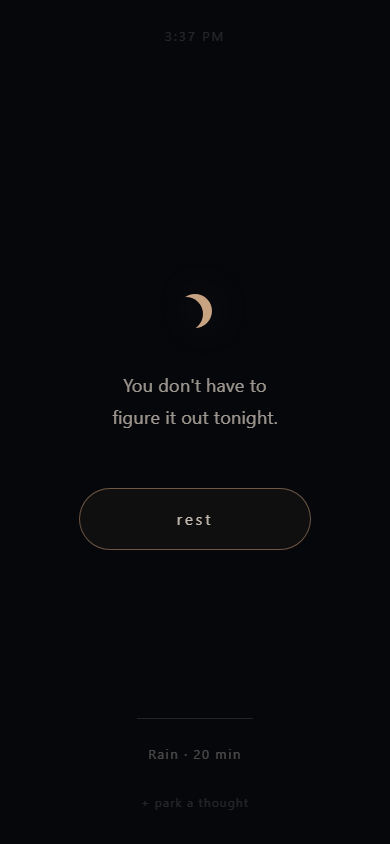
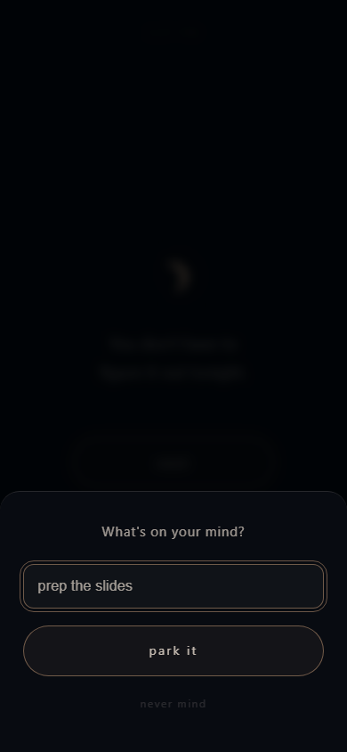
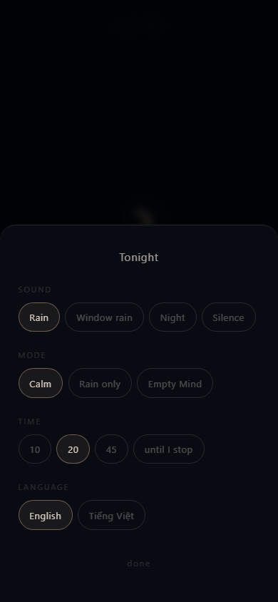
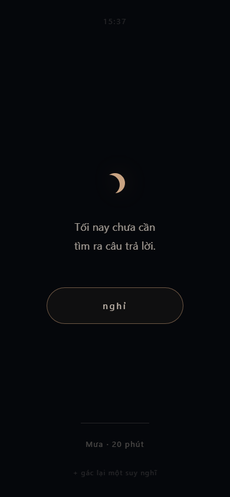

# Later.

[](https://github.com/xShiroeNguyenx/Later/actions/workflows/deploy.yml)
[](LICENSE)

> You don't have to solve everything tonight.

A tiny web app for nights when your mind won't stop. Open it, tap one button, and
a few minutes later you can sleep.

Not a sleep tracker. Not a meditation library. Not a music player. It does one
thing: **overthinking → rest**.

No account, no database, no notifications, no analytics. Works offline. Installs
to the home screen. English and Vietnamese.

**Live:** [later.techdecoded.net](https://later.techdecoded.net/) — published on
every push to `main`. Add it to your home screen and it opens like a native app,
offline.

| | |
|---|---|
|  |  |
| **Nothing to decide.** The time, one line, one button. | **4 seconds in, 6 out.** No progress bar — it fades away on its own after twelve seconds. |
|  |  |
| **Park a thought** so your brain stops rehearsing it. Never read back to you at night. | **Every choice on one screen**, applied on tap. No steps, no confirm. |

---

## Run it

```bash
npm install
npm run dev -- --host      # --host so you can open it on a real phone over LAN
```

```bash
npm run build              # typecheck + production build into dist/
npm run preview            # serve dist/ — needed to test the service worker
npm run size               # bundle budget check
npm run test:e2e           # 86 end-to-end checks in a real browser
npm run assets             # regenerate audio + icons (rarely needed)
```

Requires Node 20 or newer. `npm run test:e2e` needs a browser once —
`npx playwright install chromium` — then builds nothing and serves `dist/` itself.

### Tests

[`tests/e2e.mjs`](tests/e2e.mjs) drives a real production build in a real browser:
the whole flow, both endings, offline playback, the night rule, a tap that lands
before hydration, reduced motion, and both languages. Two of its checks exist
specifically to catch bugs that only show up on a phone:

- **`ending/lull`** re-creates iOS Safari's read-only `volume` and asserts the
  session stops *inside* the lull authored into the loop seam, rather than cutting
  out mid-downpour.
- **`offline`** loads, plays, goes offline, reloads, and plays again. This is what
  caught the service worker never caching the audio at all — a media element asks
  for byte ranges and a 206 response is not cacheable.

What no browser on a desktop can check is whether audio really keeps playing on a
locked phone. That is the first item in [docs/RELEASE.md](docs/RELEASE.md).

---

## How it works

### Opening fast is a feature

Someone reaching for this at 2:17 AM should not watch a spinner.

- `index.html` carries a **static shell** — the moon, the wording, the Rest
  button, and every style the app owns, inline. It paints in 90–215 ms with no
  stylesheet request and no flash of unstyled text.
- A small inline script fills in the clock and the returning-user wording, and
  **starts the audio if Rest is tapped before the bundle arrives**. Autoplay
  permission only exists inside the gesture that caused it, so waiting for
  JavaScript would mean tapping into silence.
- The app then hydrates into identical markup and removes the shell. Nothing
  moves.
- App JavaScript is **16.9 kB gzip** (budget: 60 kB, enforced in CI by
  `npm run size`). `index.html` alone is 4.9 kB and is enough to paint.

### Two audio layers, because only one survives a locked screen

| | what it is | when it plays |
|---|---|---|
| **Bed** | `<audio loop>` on an AAC/M4A file, untouched by Web Audio | always, including screen locked |
| **Texture** | Web Audio: droplets, shimmer, distant thunder | only while the app is in the foreground |

iOS keeps a plain media element playing all night but suspends any
`AudioContext` the moment the screen locks. So the sound that has to survive the
night lives on the element, and the texture layer — whose only job is to hide the
48-second loop point — is treated as garnish that may vanish.

**The awkward part is fading.** iOS Safari makes `HTMLMediaElement.volume`
read-only, so on iPhone there is no software fade at all. Instead each bed is
generated with a **lull authored into the loop seam** (−6 to −9 dB over ~3
seconds, verified after encoding), and playback starts and stops *inside that
lull*. The content does the fading. Where `.volume` does work, a real fade runs
instead — detected once by writing to it and reading it back, never by sniffing
the user agent.

### Two languages, no flash



The static shell ships both languages as sibling spans, and a script in `<head>`
sets `html[lang]` before the body is parsed — CSS then hides the pair that is not
wanted. So a Vietnamese reader never sees a frame of English. Doing the swap after
the shell had rendered would have been visible.

The translation is written for tone, not word-for-word. The English leans on
permission ("you don't have to"), and Vietnamese *"chưa cần"* — not yet needed —
carries that better than a literal negation, while also echoing the name of the
app. Vietnamese also gets a 24-hour clock, because that is how the time is
actually read there.

The session timeline stores cue **keys**, not sentences, so both languages are
paced identically.

<br clear="right" />

### The clock never counts ticks

Background tabs get their timers throttled hard, so a session that counted
intervals would drift by minutes with the screen off. Every tick recomputes from
`Date.now()`, which makes a missed tick harmless. Ticks arrive from the bed's
`timeupdate` event as well as an interval — `timeupdate` is tied to the audio and
keeps firing while the phone is locked.

The breathing orb is a CSS animation, not `requestAnimationFrame`, for the same
reason: rAF stops dead in a background tab.

### Audio assets are synthesised, not sampled

`npm run audio` generates every sound from scratch with about 200 lines of DSP
(`scripts/dsp.mjs`). Nothing was downloaded, so there is no licence to track, and
the loops are seamless by construction: one period of noise is tiled, filtered,
and only the final period kept — by then the filters have settled into their
steady state, so tail joins head exactly.

Icons are generated the same way, by a hand-rolled PNG writer, so the toolchain
has no image dependency.

Audio is deliberately **not** precached — a first visit costs ~21 kB, not a
megabyte. The beds land in the cache the first time they play, pulled through a
plain `fetch()` because a media element's range request returns a 206 that no
cache will accept.

---

## Design rules worth not breaking

**Parked thoughts are never shown at night.** Between 20:00 and 06:00 the list
does not exist. Reading your own worries back at 2 AM restarts exactly the loop
this app is for. They surface as one faint line during the day, and only if you
tap it.

**The exhale is longer than the inhale** — 4 seconds in, 6 out. That asymmetry is
the part that actually engages the parasympathetic side; an even rhythm looks the
same and does considerably less. (4-7-8 was tried and dropped: holding for seven
seconds is unpleasant if you have never practised it, and can make an anxious
person more anxious.)

**The guided modes instruct the body, never the mind.** Breathe and Let go are
the two modes that ask for anything at all, and every line is a single physical
instruction — unclench your jaw, let the shoulders sink. An overthinking mind is
juggling ten things at once; one physical instruction displaces them without
becoming another item on the list. In Breathe mode the in/out words are driven
by the orb animation's own events, so word and motion cannot drift apart.

**Empty Mind is empty visually too** — no orb, no motion, no sound, and a stretch
of three minutes with nothing on screen at all. Without that it is just "Calm
with the sound off".

**No progress bar and no countdown.** Seeing "14:32 remaining" puts you back into
thinking about time.

**No streaks, no statistics, no reminders.** A streak is a pressure. This is the
one product decision most likely to get argued away later; it shouldn't be.

---

## Privacy

Everything stays on the device, and that is a checkable claim rather than a
promise:

- There is no account, no server, no database, no analytics, and no cookies.
- The only network requests the app ever makes are for its own files — HTML, one
  JavaScript bundle, the audio, the icons — all served as static files.
- Parked thoughts live in `localStorage` under `later.thoughts.v1` and are never
  transmitted anywhere. So do your settings, under `later.prefs.v1`.
- Clearing site data for the page erases them. Nothing else has a copy, including
  you — there is no export yet.

The flip side of that last point: parked thoughts are not backed up and do not
sync between devices.

---

## Browser support

| | Install to home screen | Plays with screen locked | Software fade | Texture layer in background |
|---|---|---|---|---|
| iOS Safari 15+ | yes | by design — **unverified on device** | no; the seam lull covers it | no (`AudioContext` suspends) |
| Chrome / Android | yes | by design — **unverified on device** | yes | yes |
| Chrome, Edge desktop | — | n/a | yes | yes |
| Firefox | yes | yes | yes | yes |
| Safari, macOS | — | n/a | yes | yes |

Requires AAC-in-MP4 playback (universal since ~2013) and the Web Audio API for
the texture layer. Without Media Session there are no lock-screen controls;
everything else still works.

### Known limitations

1. **Lock-screen playback has not been confirmed on a physical phone.** The
   architecture exists for it and passes everything a desktop browser can check —
   including a run with iOS's `volume` restriction emulated, where the ending
   correctly landed at 46.4 s, inside the authored lull. But the behaviour itself
   is still an expectation. It is the first item in
   [docs/RELEASE.md](docs/RELEASE.md), and it gates 1.0.
2. **On iOS a timer ends within ±24 s of the requested time**, because it waits for
   the next lull rather than cutting out mid-downpour. Fine for a sleep timer,
   but it is not exact.
3. **The texture layer stops when iOS backgrounds the app.** By design — the bed
   carries on alone, and the loop point is only really noticeable when you are
   awake and looking at the screen anyway.
4. **The 48-second loop has been measured, not judged by ear** over a long
   session. The seam discontinuity is 1.13× a normal sample-to-sample step, i.e.
   no step at all, and the level either side matches within 1 dB.
5. **Empty Mind is silent, so the page can be suspended** in the background. The
   timeline catches up from timestamps when you return, but the closing line may
   not appear at the exact second.
6. **No export, no sync, no backup** for parked thoughts. See Privacy above.

---

## Deploying

Pushing to `main` builds, checks and publishes to GitHub Pages. Pushing a `v*.*.*`
tag creates a GitHub release, with notes taken from `CHANGELOG.md` and a zip of the
built site attached for self-hosting. See
[.github/workflows/deploy.yml](.github/workflows/deploy.yml) and
[docs/RELEASE.md](docs/RELEASE.md).

Enable publishing once, in **Settings → Pages → Source → GitHub Actions** — until
that is set, the workflow builds and passes but has nowhere to deliver to. Pages on
a private repository needs GitHub Pro; alternatives are noted in
[docs/RELEASE.md](docs/RELEASE.md).

### Where the site is served from

This is the one thing that has actually broken in production, so it is worth
understanding.

A GitHub Pages project site lives at `/<repo>/`; a user site or **any custom
domain** lives at the root. The workflow decides between them:

| | base |
|---|---|
| `public/CNAME` exists | `/` — a custom domain always serves from the root |
| repository is `<owner>.github.io` | `/` |
| anything else | `/<repo>/` |

Every asset URL is built from that prefix: `%BASE_URL%` in `index.html`,
`import.meta.env.BASE_URL` in `src/audio/layers.ts`, and the generated web
manifest. **If you add a custom domain, add it to `public/CNAME`** — otherwise the
build assumes `/Later/` and every asset 404s.

Two checks guard it, and they are not redundant:

- `scripts/check-base.mjs` greps the real build output for anything root-absolute
  that slipped through. It proves the build is *internally consistent* with the
  base it was handed.
- `scripts/smoke.mjs` fetches the **deployed** site and confirms the bundle,
  manifest, icon and audio all resolve. It proves that base was the *right* one.

Only the second can catch a base/host mismatch, and the failure it catches is a
nasty one: `index.html` returns 200 and every asset 404s, so the page paints
perfectly — all its CSS is inline — and then does nothing at all. The bundle never
loads, React never mounts, and the static shell stays up with a settings line that
is a `<span>` rather than a button. It looks like a working app that ignores you.

To build for a subpath by hand:

```bash
BASE_PATH=/Later/ npm run build && BASE_PATH=/Later/ npm run check-base
```

On Git Bash for Windows, MSYS rewrites `/Later/` into a Windows path — use
PowerShell: `$env:BASE_PATH='/Later/'; npm run build; npm run check-base`.

---

## Adding a language

Most of it is one table entry:

1. Add the code to `Lang` in `src/i18n.ts` and an entry to `LANGS`.
2. Copy the `en` object in the same file and translate it. TypeScript will tell
   you if you miss a key, including the cue lines.
3. If the clock reads differently, add a branch to `formatClock` in
   `src/lib/clock.ts` — and mirror it in the inline script in `index.html`, which
   has the same two rules and a comment saying so.
4. Add the shell strings to `index.html`: the lede, the Rest label, the default
   summary, and the two returning-visitor lines in the body script.

One honest caveat: the shell's hide-the-other-language CSS rule is written for
exactly two languages. A third needs that selector reworked — a few lines, but not
zero.

---

## Layout

```
index.html            static shell + the entire design system, inline
.github/workflows/
  deploy.yml          build, budget check, base check, publish to Pages
docs/
  RELEASE.md          release checklist, including the device tests that gate it
scripts/
  dsp.mjs             filters, noise, the seamless-loop trick, WAV writer
  gen-audio.mjs       synthesises the four beds and two thunder one-shots
  gen-icons.mjs       PNG encoder + crescent artwork
  size.mjs            bundle budget check
  check-base.mjs      proves a build is consistent with the base it was given
  smoke.mjs           asks the deployed site whether that base was the right one
  changelog-section.mjs  release notes, straight from CHANGELOG.md
tests/
  e2e.mjs             80 checks against a real build in a real browser
src/
  i18n.ts             every string, in English and Vietnamese
  audio/              engine (two layers), procedural texture, MediaSession
  session/            clock/state machine, cue timings by key, breathing orb
  park/               thought parking + the night rule
  screens/            Home, Session, Picker, Sheet
  lib/                clock, prefs, auto-dim
```

Source is written as ordinary React + TypeScript; `react` is aliased to
`preact/compat` at build time, which is what gets the runtime from ~48 kB to
~11 kB gzip. See the comment at the top of `vite.config.ts` to go back to real
React — no source file changes needed.

`PLAN.md` is the original plan, kept alongside a log of every place the build
ended up differing from it and why.

---

## Not in scope

An AI companion (worth building once real people use this — and its job would be
to help set a thought down, never to solve it), accounts, sync, sleep tracking,
statistics, reminders.

---

## License

[MIT](LICENSE). The audio and icons are generated by the scripts in this
repository rather than sourced from anywhere, so they carry no separate
attribution requirement.
